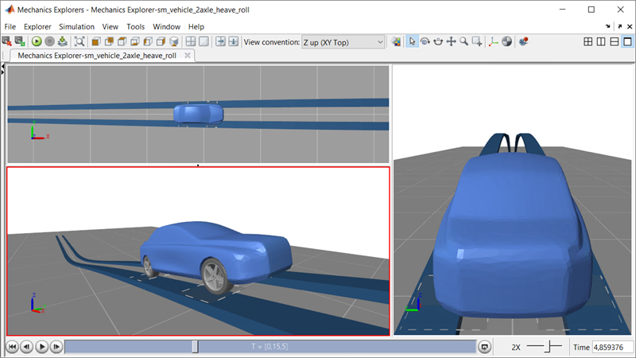

# **Vehicle Dynamics, 14 DOF Model in Simscape Multibody&trade;**
Copyright 2021-2022 The MathWorks, Inc.

This example models a vehicle with heave and roll degrees of freedom for
the front and rear axles.  The driver inputs and scene where the vehicle 
is driving can be configured as you select one of the maneuvers.

The **[Simscape Multibody Tire Model](https://www.mathworks.com/help/physmod/sm/ref/magicformulatireforceandtorque.html)** is tested under various conditions:

* **Step Steer Maneuver** to test lateral dynamics
* **Traversing a Plateau** to test the effect of road slope 
* **Parking Lot Maneuver** to test behavior at zero speed
* **Slalom on a Hill** to test behavior at low speed and in reverse
* **Rough Road** to show road definitions using surface data in MATLAB
* **Icy Surface** to test braking systems on surfaces with varying friction 

Open the project file sm_vehicle_heave_roll.prj to get started.

**Acknowledgements**: MathWorks would like to thank M V Krishna Teja, PhD, 
[Virtual Proving Ground and Simulation Lab](https://prof-rkkumar.wixsite.com/iitm-vpg-lab), 
Raghupati Singhania Centre of Excellence at the Indian Institute of Technology, 
Madras for providing the tire parameters for this example.

## **Visualization**

## **Model Overview**

## **Vehicle Model**

## **Tire Model**

To learn more about vehicle modeling and simulation with Simscape, please visit:
* [Simscape Vehicle Templates](https://www.mathworks.com/solutions/physical-modeling/simscape-vehicle-templates.html)
* See also:
   * [Simscape&trade;](https://www.mathworks.com/products/simscape.html)
   * [Simscape Battery&trade;](https://www.mathworks.com/products/simscape-battery.html)
   * [Simscape Driveline&trade;](https://www.mathworks.com/products/simscape-driveline.html)
   * [Simscape Electrical&trade;](https://www.mathworks.com/products/simscape-electrical.html)
   * [Simscape Fluids&trade;](https://www.mathworks.com/products/simscape-fluids.html)
   * [Simscape Multibody&trade;](https://www.mathworks.com/products/simscape-multibody.html)
